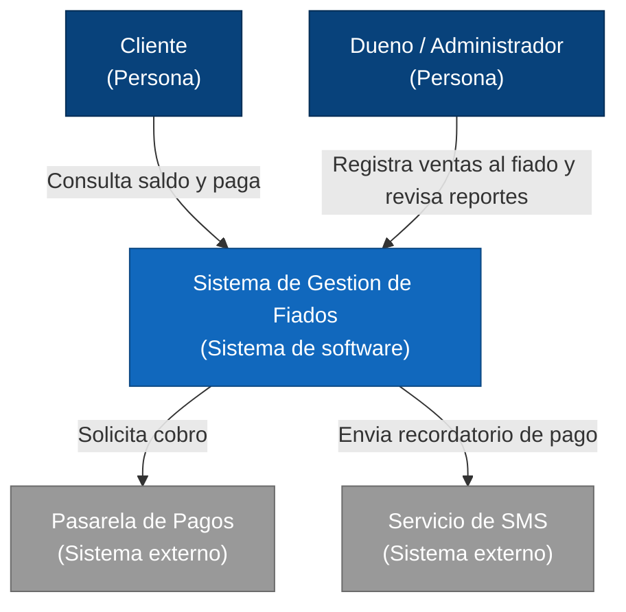
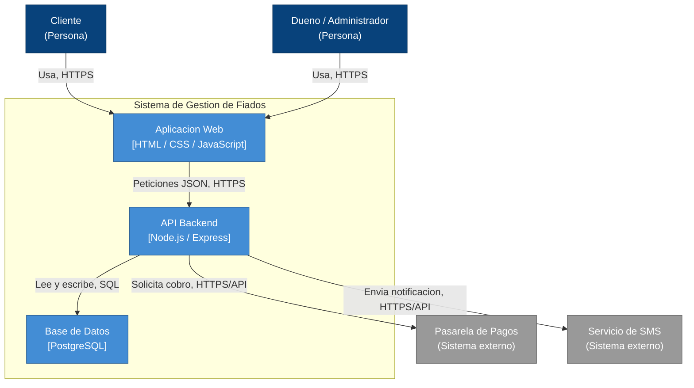

# Practica 6 - Diagrama C4 del Sistema de Gestion de Fiados

Este documento presenta la arquitectura del Sistema de Gestion de Fiados (mismo dominio usado en las practicas 4 y 5) usando el modelo C4, en dos niveles de zoom: contexto y contenedores.

## Nivel 1 - Diagrama de Contexto

### Decisiones de diseno (contexto)

Se decidio integrar el cobro de fiados con una Pasarela de Pagos externa en lugar de procesar tarjetas dentro del propio sistema. Esto prioriza la seguridad: el sistema nunca almacena ni maneja datos sensibles de tarjetas, delegando ese riesgo y el cumplimiento normativo al proveedor externo.

Tambien se decidio modelar un unico Sistema de Gestion de Fiados como caja negra frente a los actores, en lugar de exponer directamente sus componentes internos. Esto prioriza la mantenibilidad: los actores externos dependen de un contrato estable, y la implementacion interna puede cambiar sin afectarlos.

## Nivel 2 - Diagrama de Contenedores

### Decisiones de diseno (contenedores)

Se separo la Aplicacion Web del API Backend en dos contenedores independientes en lugar de un monolito que renderiza vistas desde el servidor. Esto prioriza la escalabilidad: el API puede escalar horizontalmente segun la carga de peticiones sin escalar tambien la capa de presentacion, y ambos pueden desplegarse por separado.

Se eligio una base de datos relacional (PostgreSQL) en lugar de almacenamiento en archivos planos o una base no relacional. Esto prioriza la consistencia de los datos: las relaciones entre clientes, ventas al fiado, pagos e inventario requieren integridad referencial y transacciones, algo que un archivo plano no garantiza.

## Correcciones al borrador generado por IA

El primer borrador de estos diagramas se genero pidiendole a una IA un C4 generico para "un sistema de ventas", y luego se corrigio para ajustarlo al proyecto real. La siguiente tabla documenta las alucinaciones detectadas y como se corrigieron.

| Elemento inventado por la IA | Correccion aplicada |
|---|---|
| Proponia Kafka como broker de mensajeria entre contenedores | Se elimino: el proyecto no usa mensajeria asincrona, la comunicacion es HTTP sincrono entre la web y el API |
| Proponia Redis como cache de sesiones | Se elimino: el alcance actual del proyecto no requiere cache, seria sobreingenieria para el tamano del sistema |
| Sugeria un contenedor Mobile App en React Native | Se elimino: el proyecto solo tiene interfaz web, no existe una app movil |
| Sugeria MongoDB como base de datos | Se corrigio a PostgreSQL: los datos tienen relaciones claras entre si y requieren integridad referencial, mejor cubierta por una base relacional |
