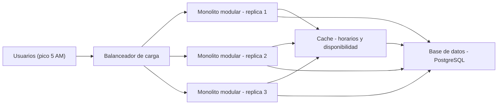

# ADR-001: Arquitectura del sistema de venta de boletos de la cooperativa de buses

## Estado

Aceptado

## Contexto

El sistema del capstone SE1 vende boletos para una cooperativa de buses. Tiene 50,000 usuarios registrados y presenta un pico de venta muy marcado a las 5 AM, cuando la gente compra boletos para el primer bus del dia. El gerente pidio usar microservicios porque "lo leyo en LinkedIn", pero esa razon no es un atributo de calidad, es moda. Antes de decidir la arquitectura hay que priorizar que problema real se esta resolviendo.

Atributos de calidad priorizados y por que:

Atributo 1, rendimiento en lectura durante el pico: el trafico de las 5 AM es mayormente consultas repetidas de horarios y disponibilidad de asientos sobre datos que cambian poco en esa ventana de tiempo. Esto es un problema de lectura repetida, no de escritura masiva.

Atributo 2, disponibilidad en el pico: el sistema no se puede caer justo cuando ocurre la mayor parte de las ventas del dia; una caida a las 5 AM tiene impacto directo en los ingresos.

Atributo 3, simplicidad operativa: el equipo es el equipo de un capstone, pocas personas, sin equipo de DevOps dedicado ni experiencia previa operando sistemas distribuidos en produccion.

Atributo 4, costo: la cooperativa tiene presupuesto limitado; no se justifica pagar por infraestructura que resuelve un problema que el sistema no tiene.

Explicitamente NO se prioriza: escalabilidad organizacional (no existen multiples equipos que necesiten desplegar servicios de forma independiente). Este punto es central para la decision, porque es la principal ventaja que ofrecen los microservicios y no aplica en este caso.

## Opciones consideradas

### Opcion A: Monolito modular + cache

Pros para este caso: es simple de operar y desplegar con el equipo disponible; resuelve directamente el problema real (lectura repetida de horarios y disponibilidad) agregando una cache delante de esas consultas; bajo costo de infraestructura; el codigo modular permite mantener limites claros entre dominios (ventas, horarios, pagos) sin pagar el costo operativo de servicios separados.

Contras para este caso: escalar una parte especifica (por ejemplo, solo el modulo de consulta de horarios) implica escalar el proceso completo, no solo esa parte; un despliegue afecta a todo el sistema a la vez.

### Opcion B: Microservicios

Pros para este caso: permite escalar cada servicio de forma independiente; aisla fallos entre servicios; permitiria a equipos distintos desplegar sin coordinarse.

Contras para este caso: la cooperativa no tiene equipos distintos que necesiten desplegar de forma independiente, asi que su principal ventaja no aplica aqui; agrega complejidad operativa desproporcionada (orquestacion, red entre servicios, observabilidad distribuida) para un equipo de capstone sin experiencia previa en esto; la latencia de red entre servicios puede empeorar justo el problema que se quiere resolver (rendimiento en el pico); mayor costo de infraestructura.

### Opcion C: Serverless (funciones)

Pros para este caso: escala automaticamente segun la demanda sin gestion manual de servidores; se paga solo por uso, lo cual encaja con un trafico muy concentrado en una ventana corta del dia.

Contras para este caso: el cold start (arranque en frio de una funcion inactiva) puede agregar latencia justo en el momento mas critico, el pico de las 5 AM; mayor dependencia del proveedor especifico (vendor lock-in); es mas dificil de depurar localmente y el equipo no tiene experiencia previa con este modelo.

## Decision

Se elige la Opcion A: monolito modular con cache para las lecturas repetidas, desplegado en multiples replicas detras de un balanceador de carga para absorber el pico de las 5 AM.

Por que: el problema identificado en el contexto es lectura repetida sobre datos de baja variabilidad (horarios, disponibilidad de asientos) concentrada en una ventana corta y predecible del dia, combinado con un equipo pequeno sin capacidad operativa para sistemas distribuidos. Ninguna de esas dos condiciones se resuelve mejor con microservicios: la cooperativa no tiene el problema de organizacion de equipos que los microservicios resuelven, y pagar su complejidad operativa sin necesitar esa ventaja es un mal trade-off. "Microservicios porque es lo moderno" no es una justificacion valida; "monolito modular mas cache porque nuestro problema es lectura repetida, no organizacion de equipos" si lo es.

Las palancas de escala usadas son solo las justificadas por el problema real: cache para las consultas repetidas, y balanceo de carga con replicas horizontales del mismo monolito para el pico de trafico. No se usa sharding de base de datos ni colas de mensajeria porque no hay evidencia de un cuello de botella de escritura ni de procesamiento asincrono que las justifique.

## Consecuencias

Que se acepta perder con esta decision:

Se pierde la capacidad de escalar o desplegar modulos de forma completamente independiente; por ejemplo, el modulo de pagos no puede escalar solo sin escalar todo el monolito. Se acepta porque no hay evidencia de que algun modulo necesite una escala desproporcionada respecto a los demas.

Se pierde el aislamiento fuerte de fallos entre modulos que dan los microservicios; un error grave en un modulo puede afectar al proceso completo. Se mitiga con buena modularizacion interna y manejo de errores, pero es un riesgo que se acepta conscientemente.

Se pierde la posibilidad de que equipos distintos desplieguen sin coordinarse. No es un costo real hoy porque no existen esos equipos, pero si la cooperativa crece mucho y se forman equipos separados por dominio, esta decision debera revisarse.

Se pierde la etiqueta de "arquitectura moderna" que pedia el gerente. Es un trade-off consciente: se prioriza resolver el problema real sobre seguir una tendencia.

Esta decision es revisable: si el trafico crece varios ordenes de magnitud o aparecen multiples equipos que necesiten desplegar de forma independiente, se debera abrir un nuevo ADR reevaluando la arquitectura.
